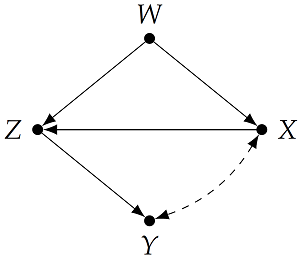
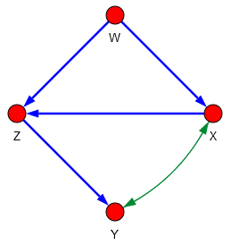
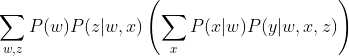

# causaleffect

`causaleffect` is a Python library for computing conditional and non-conditional causal effects.

## Installation

Use the package manager [pip](https://pip.pypa.io/en/stable/) to install `causaleffect`.

```bash
pip install causaleffect
```

If one wants to plot graphs with the `plotGraph` function, either the `pycairo` library (version `1.17.2` or later) or the `cairocffi` library is also required.

## Usage

If we want to compute the causal effect P(y|do(X=x)) from the causal diagram shown below,



we first create and display the graph:

```python
import causaleffect

G = causaleffect.createGraph(['X<->Y', 'Z->Y', 'X->Z', 'W->X', 'W->Z'])
causaleffect.plotGraph(G)
```
which renders the following image



Then we can compute the causal effect by executing:

```python
P = causaleffect.ID({'Y'}, {'X'}, G)
P.printLatex()
```

The code above computes the causal effect, and returns a string encoding the distribution in LaTeX notation:
```
'\sum_{w, z}P(w)P(z|w, x)\left(\sum_{x}P(x|w)P(y|w, x, z)\right)'
```

This string, in LaTeX, is



## Examples

Some examples from the dissertation can be found in this repository:

| Figure number   | Example file                             |
|-----------------|------------------------------------------|
| Figure 3.5 (a)  | [`example_1.py`](examples/example_1.py)  |
| Figure 3.6 (a)  | [`example_2.py`](examples/example_2.py)  |
| Figure 3.6 (b)  | [`example_3.py`](examples/example_3.py)  |
| Figure 3.10     | [`example_4.py`](examples/example_4.py)  |
| Figure 3.12     | [`example_5.py`](examples/example_5.py)  |
| Figure 3.13     | [`example_6.py`](examples/example_6.py)  |
| Figure 3.15 (a) | [`example_7.py`](examples/example_7.py)  |
| Figure 3.15 (b) | [`example_8.py`](examples/example_8.py)  |
| Figure 3.16     | [`example_9.py`](examples/example_9.py)  |
